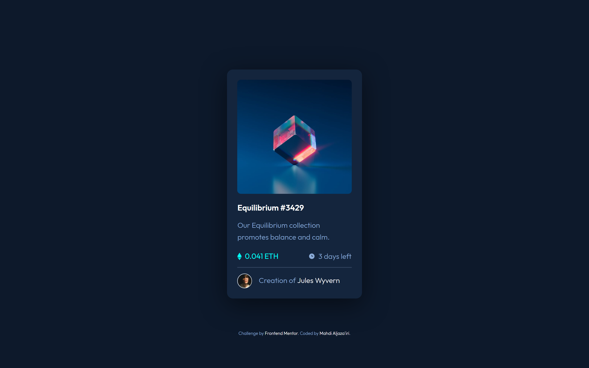

# Frontend Mentor - NFT preview card component solution

This is a solution to the [NFT preview card component challenge on Frontend Mentor](https://www.frontendmentor.io/challenges/nft-preview-card-component-SbdUL_w0U).  
Frontend Mentor challenges help you improve your coding skills by building realistic projects. 

\*Me\* : I agree 👍

## Table of contents

- [Overview](#overview)
  - [The challenge](#the-challenge)
  - [Screenshot](#screenshot)
  - [Links](#links)
- [My process](#my-process)
  - [What am I doing?](#what-am-i-doing)
  - [What I learned](#what-i-learned)
- [Tools](#tools)
- [Author](#author)

## Overview

### The challenge

Users should be able to:

- View the optimal layout depending on their device's screen size
- See hover states for interactive elements

### Screenshot

### Links

- Solution URL: <https://your-solution-url.com>
- Live Site URL: <https://nft-preview-card-component-solution-1234.netlify.app>

## My process

### What am I doing?

You might be wondering what's going on with the `.parent-link` & `.child-link` thing..  
Well, basically the design dictates that **only** the name of the creator gets treated as a link. Thus receiving the pointer events and hover interactions.

If you think about it again, though, only defining the name of the creator as an anchor give less hit-space than anticipated from such components --especially on mobile devices. Social media platforms in average make the whole box containing a user name clickable, including the avatar and any other associated info.

Due to this, I tried to both meet the design requirements *and* provide the behavior mentioned afore. And since, obviously, the `:has()` pseudo-class isn't supported widely enough, I had to do everything myself.

The `.parent-link` class simply strips off the normal styles from the actual anchor element that envelopes the whole thing. And then the `.child-link` class gives these styles to that specific span element that I want to look like a link. Although with an exception.

Inorder to look and act like a link, the focus-ring must appear over the `.child-link`. But do so only on keyboard interaction. So I used the recently spread `:focus-visible` pseudo-class to capture those interactions. Hence, browsers that don't support this feature would still show the focus ring on the `.parent-link` instead.

### What I learned

The double color outline style present in most browsers nowadays is enabled via: `outline-style:auto`. This can be used to apply the default focus ring selectively.

## Tools

- [Dev Docs](https://devdocs.io) - The resource I was constantly referring to throughout the process. It's an offline web app that has a huge collection of documentations.
- [Brackets](https://brackets.io) - My text editor. Not as powerful as VSCode, but still my favorite.
- Chrome - This web page was only tested on Chrome. 

## Author

- GitHub - [Mahdi Aljaza'iri](https://github.com/MahdiAljazairi)
- Frontend Mentor - [@MahdiAljazairi](https://www.frontendmentor.io/profile/MahdiAljazairi)
